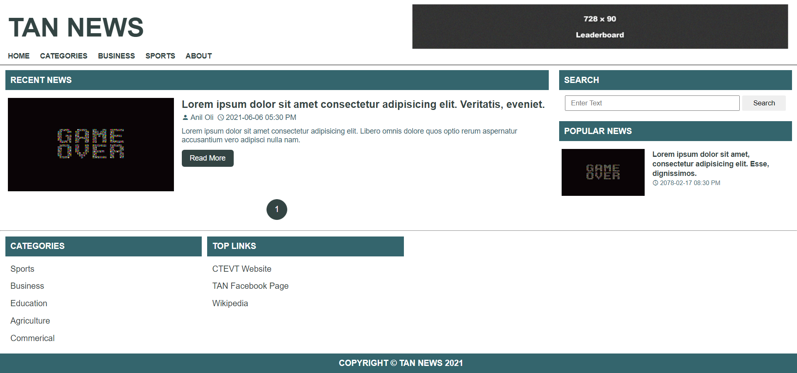
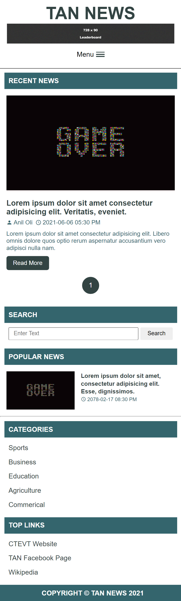

# News Template Design

---

### Table of Contents

- [Description](#description)
- [Desktop Version](#desktop)
- [Tablet Version](#tablet)
- [Mobile Version](#mobile)
- [Author Info](#author-info)

---

## Description

This is the news website front page design where you can see the news are shown as recent news. In the sidebar, search box is given to search the news. In below the search section, you can see polpular news are shown.

For the news agency, if they want to earn from the ads they have the header ads feature as well. Ads can be implement in sidebar as well as in recent news section.

#### Technologies

- HTML
- CSS
- Javascript

See Demo: [Click Here](https://rawcdn.githack.com/aniloli42/news-site-template-design/5da518b6fda84879078f15d07d5b6432fef59c9e/index.html)

[Back To The Top](#fb-clone-design)

---

## Desktop Version

---

## Tablet Version

---

## Mobile Version

---

## Author Info

- Facebook - [Anil Oli](https://facebook.com/anil.oli.4321)
- Linkedin - [Anil Oli](https://linkedin.com/in/aniloli)

> Thank you for visiting this repository.

[Back To The Top](#fb-clone-design)
