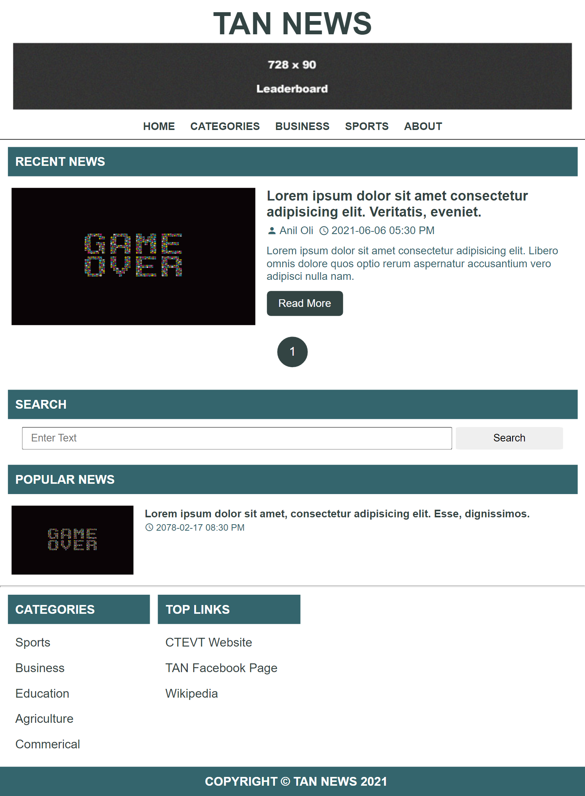

# News Template Design

---

### Table of Contents

- [Description](#description)
- [Desktop Version](#desktop)
- [Tablet Version](#tablet)
- [Mobile Version](#mobile)
- [Author Info](#author-info)

---

## Description

This is actually made for practice purpose. It is not use for any other purpose, It project can include in my portifolio.

To See the demo: [Click Here](https://rawcdn.githack.com/aniloli42/news-site-template-design/5da518b6fda84879078f15d07d5b6432fef59c9e/index.html)

#### Technologies

- HTML
- CSS
- Javascript

[Back To The Top](#fb-clone-design)

---

## Desktop Version

---

## Tablet Version

---

## Mobile Version

---

## Author Info

- Facebook - [Anil Oli](https://facebook.com/anil.oli.4321)
- Linkedin - [Anil Oli](https://linkedin.com/in/aniloli)

> Thank you for visiting this repository.

[Back To The Top](#fb-clone-design)
